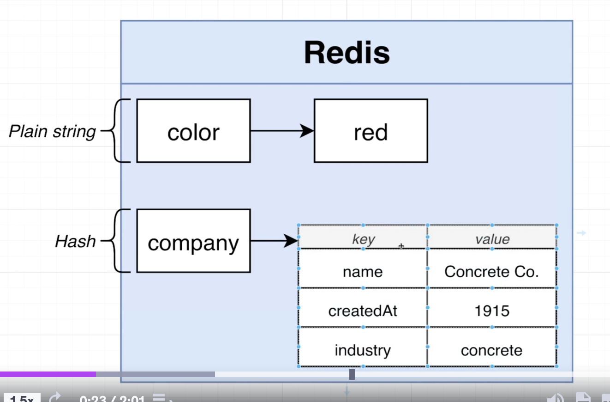
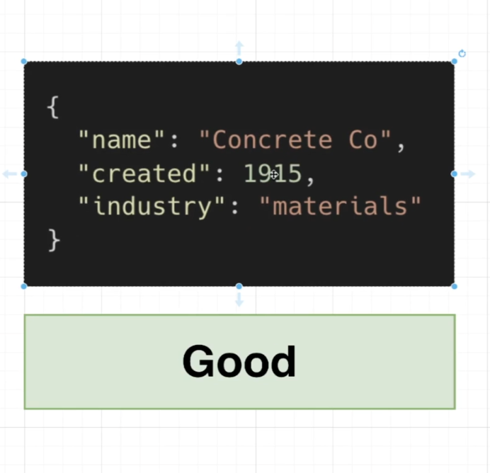
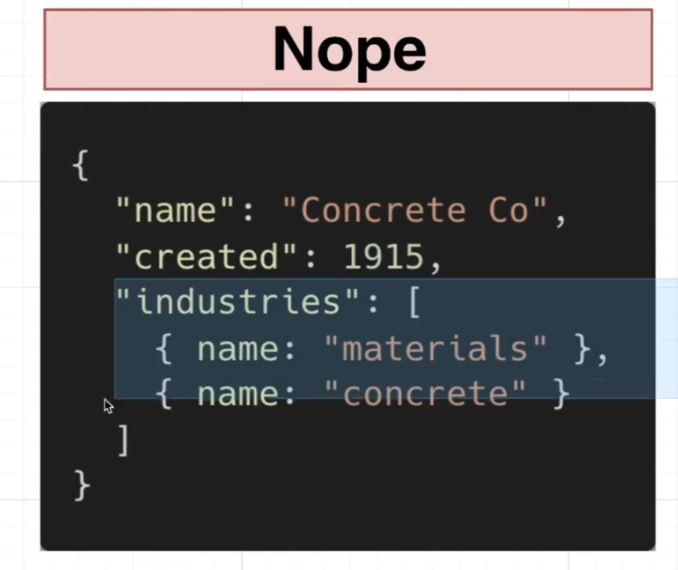
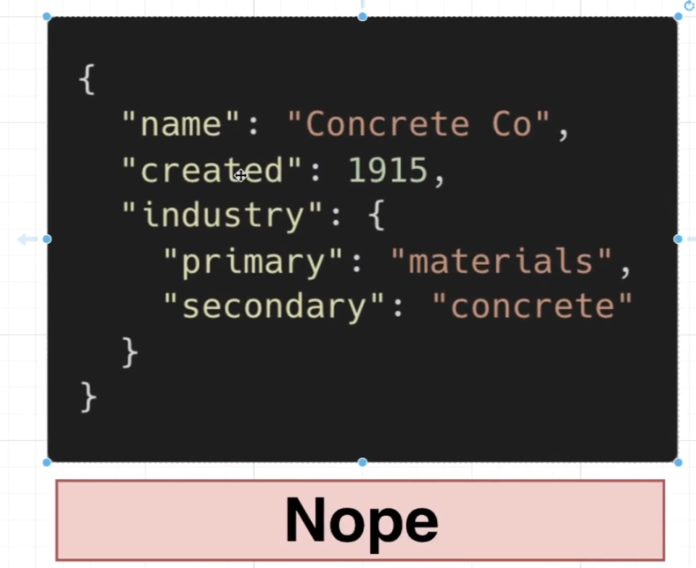
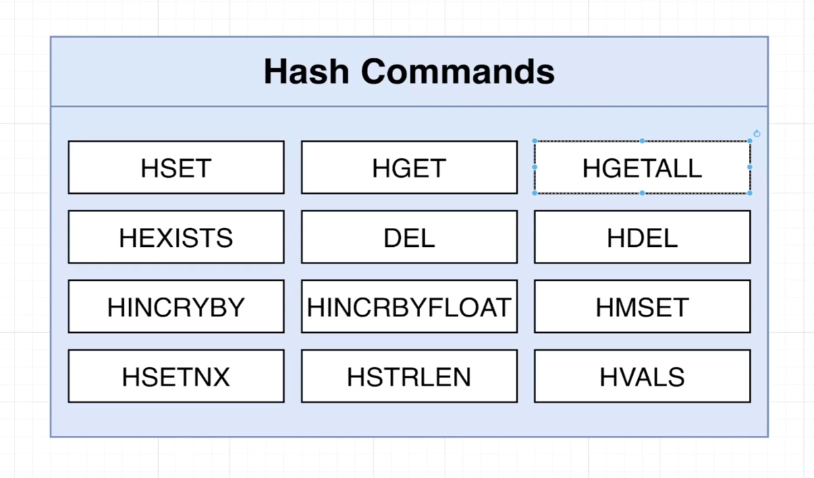
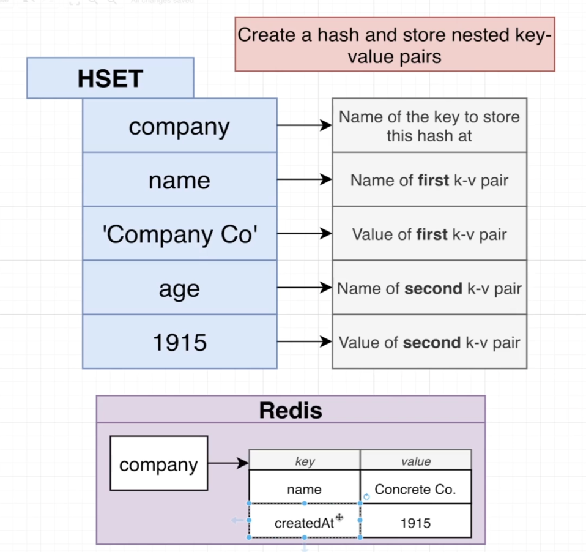
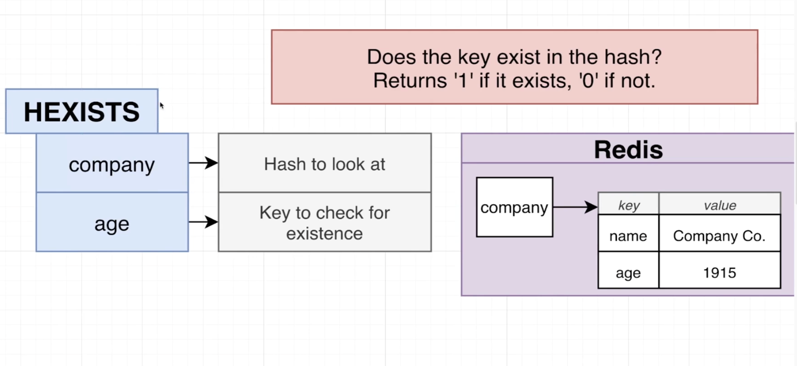

# Hash data structure

- They are not allowed for us to have nested or deeply nested ket value pairs.
- Again, a hash where the values are only strings, only numbers.

`HSET company name 'concrete co' age 1915`

- When we were setting a plane string or a plane number, we instead get a number of two. That is meant to indicate that we have updated two key value pairs in this case, name and age.

`HSET company name 'concrete co' age 1915 industry materials revenue 9.5`

- Now I would expect to get back a value of two in this case because although we have set four different key value pairs, we have only added in or really made two additional updates to our hash.

`HGET company age`

- This will return a single value.

`HGETALL company`

- this is going to give us all the different key value pairs that are stored inside of a hash. This is returned as a array for key value pairs.

`HEXISTS company age`
