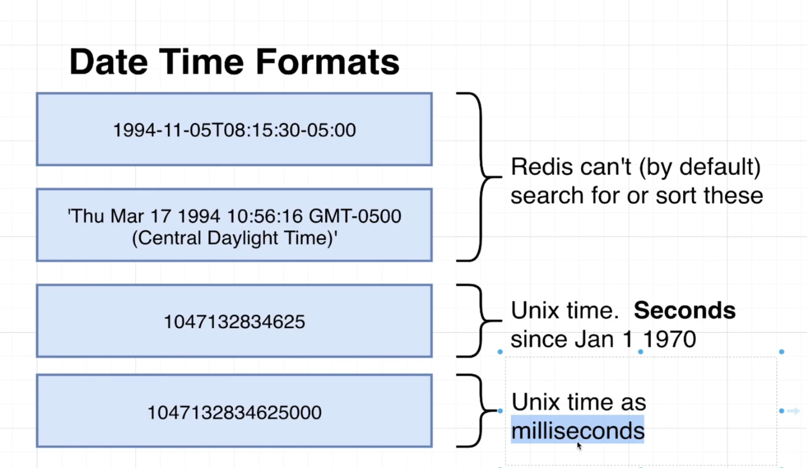
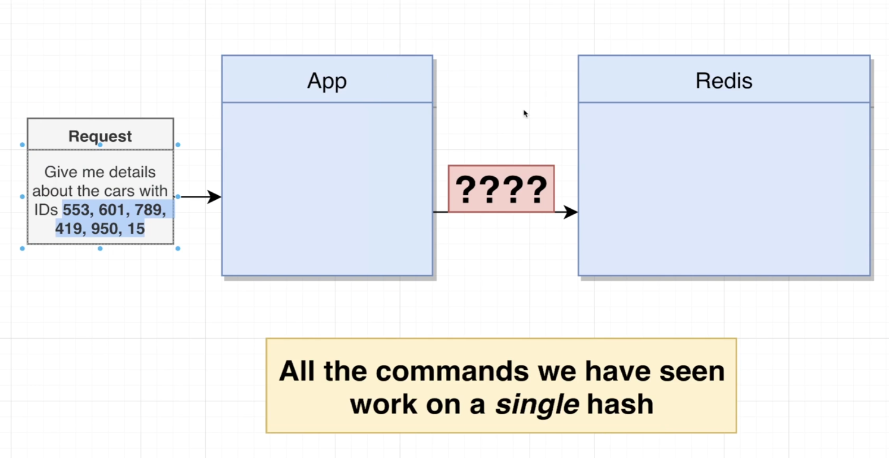
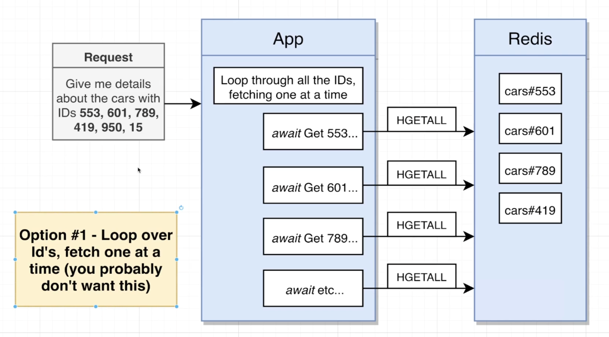
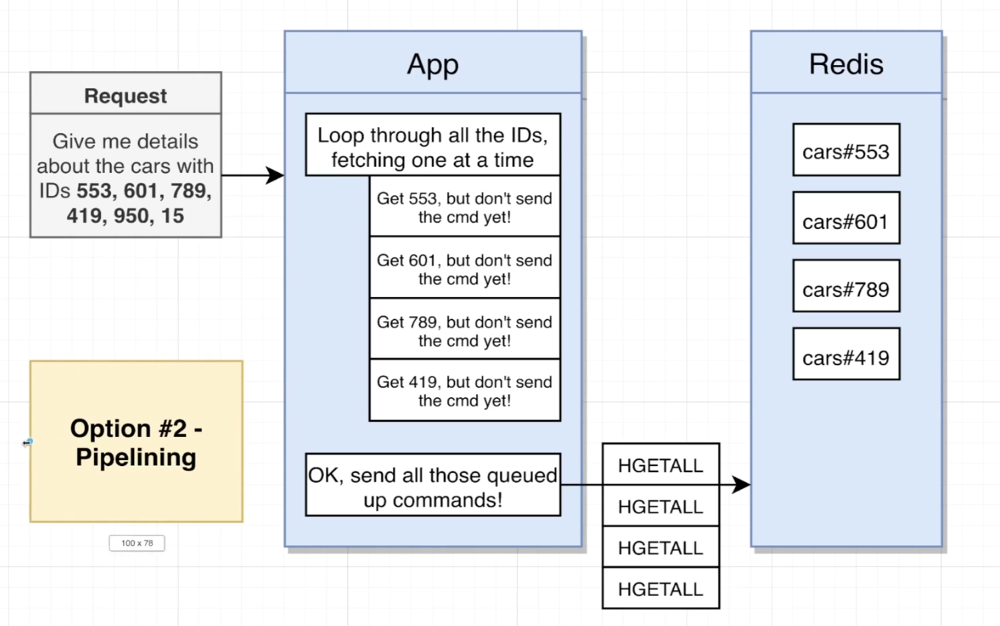
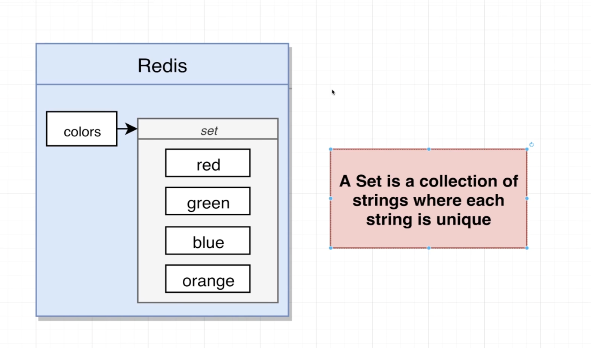
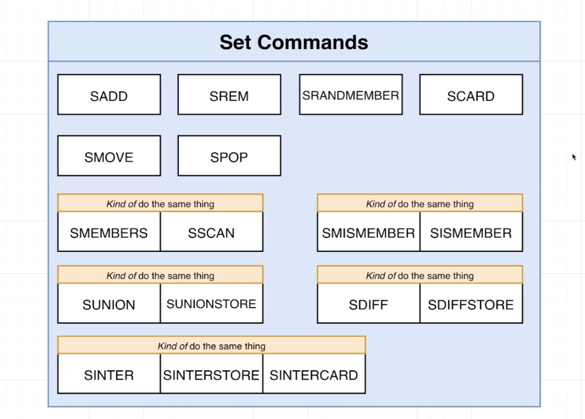
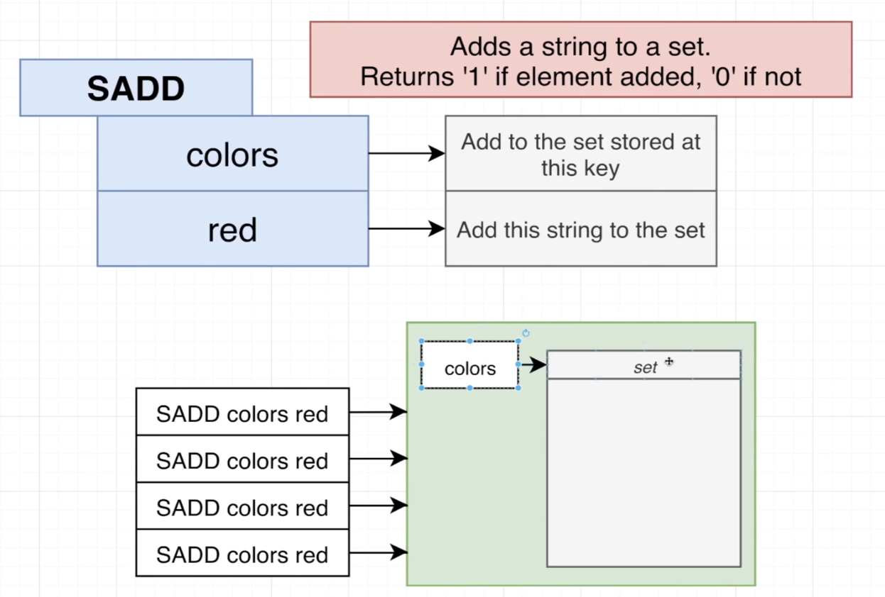
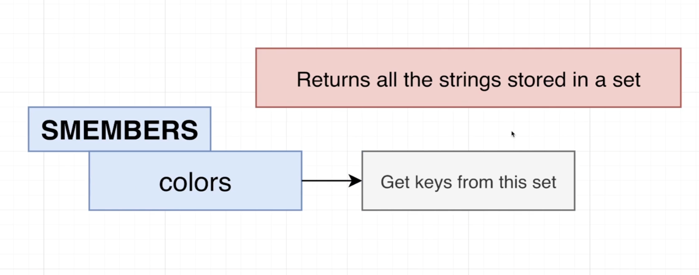

# Unix date time format

# Pipeline

- We would definitely fetch all the data we're looking for, but there's a very clear downside. We are making a wide variety of different separate requests off to Redis, and so that's just going to take some amount of time if we are trying to fetch, say, 100 different records. We're talking about making 100 different requests over to Redis, though probably not going to be very ideal.

- So in one single connection, we can send off this big group of different `hgetall`, one for each individual cars that we're trying to fetch. Redis understands this idea of batching commands together.

# Sets

