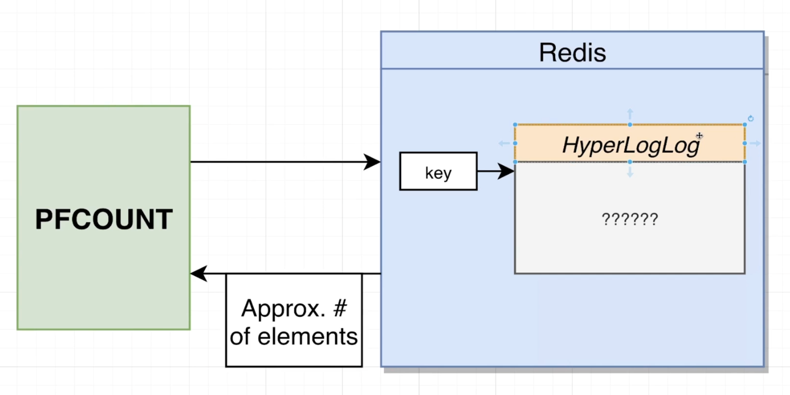

# HyperLogsLogs

- This thing has a weird name, but it is a data type, just like all the other data types we have covered so far.
- Hyperlogslogs are used whenever we want to keep track of the uniqueness of a collection of different elements, and specifically the approximate uniqueness.
- You can think of a Hyperlogslogs as being similar to a set with the important distinction that it doesn't actually store any elements.

- `PFADD` with some string or a number that's going to take that string or a number and we can imagine that it's going to add it into this Hyperlogslogs structure over here. Once we add the string in, it doesn't truly get stored inside the Hyperlogslogs. This thing has a very complex algorithm inside of it that looks at this string, does some parsing on it, does some very complex math, and kind of remembers that string, but it doesn't actually store per say.

- `PFCOUNT` allows us to look at a Hyperlogslogs and get an approximate count of the number of unique elements that have been added.

`PFADD vegetables celery`
`PFADD vegetables celery`

- So when I run this command, I'm going to get back responsive 1. If I run this command a second time, I'm going to get back 0. So again, first time we add in a string, we get back a 1. Otherwise, if this thing has already been added, we get a 0.

`PFADD vegetables potato`
`PFADD vegetables potato`

- Same as above.

`PFCOUNT vegetables`

- You can imagine that if we have many different items or we have items with many more views than 1 million , well, this is going to start to get really expensive really quickly for such a simple little feature.

- So functionally as just about identical to the set implementation. But here's the difference, because the Hyperlogslogs does not actually truly store the individual records. So it doesn't actually store these usernames or the user IDs or anything like that. It has a constant size. It is always just about 12 kilobytes, no matter what, when stored inside of Redis.
- So we could add in a million views, 2 million. 5 million, however, million we want. And we're always going to be keeping only 12 kilobytes worth of data.

- And it comes back to this downside. I had used the word approximately counting. That is the downside because the Hyperlogslogs doesn't actually truly store these individual items. It only stores a kind of approximation or representation of what it thinks it might have seen in the past, through the use of, like I said, a very fancy algorithm.
- So that is the approximate nature here, and this is the tradeoff we make for not actually storing the original individual items.
- I might not want to use a Hyperlogslogs if I'm trying to keep track of, say, unique user names or unique email addresses. But if it's something like views, I will make that trade off happily.

# Lists

`LPUSH temps 25`

`RPUSH temps 27`

`LLEN temps`

`LINDEX temps 0`

`LINDEX temps 1`

`LINDEX temps 2`

`LINDEX temps -1`

- So if We put in a -1, that means go -1, go all the way to the very end of the index or the very end of the list,

`LINDEX temps -2`

- We could put in even more negative numbers, which means go further back from the end a list.

`LINDEX temps -3`

`DEL temps`
`RPUSH temps 25`
`RPUSH temps 27`
`RPUSH temps 25`
`RPUSH temps 30`
`RPUSH temps 24`

`LRANGE temps 0 3`

`LRANGE temps 1 4`

`LRANGE temps 1 345345`

- We can go out of bounds.

`LRANGE temps 0 -1`

- starting to last.

`LRANGE temps 0 -2`

- starting to second last.

`LPOS temps 25`

`LPOS temps 27`

`LPOS temps 33453`

- lpos for a not existing value will return nil.

`LPOS temps 25 RANK 1`

`LPOS temps 25 RANK 2`

- So if I do a rank 2, that means ignore the first instance of 25 and instead find the second instance.

`LPOS temps 25 COUNT 2`

`LPOS temps 25 COUNT 3`

- We are not able to find three instances, so we're just gonna be told about the first two that were actually found.

`DEL temps`
`RPUSH temps 25`
`RPUSH temps 27`
`RPUSH temps 25`
`RPUSH temps 30`
`RPUSH temps 24`

`LSET temps 1 35`
`LRANGE temps 0 -1`

`LTRIM temps 1 4`
`LRANGE temps 0 -1`

`LINSERT temps AFTER 55 45`
`LRANGE temps 0 -1`

`LINSERT temps BEFORE 55 15`
`LRANGE temps 0 -1`

`LREM temps 0 24`
`LRANGE temps 0 -1`

# List use cases

# Donot use lists cases

