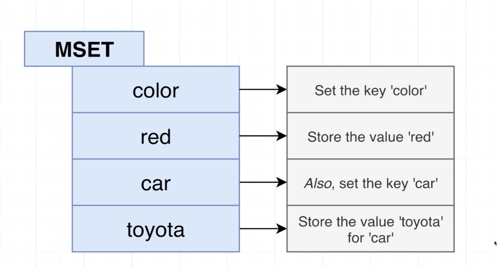
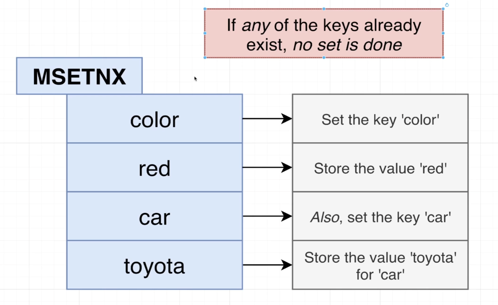
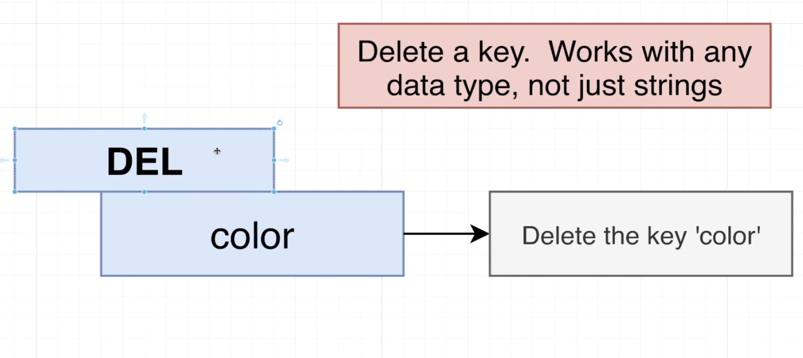
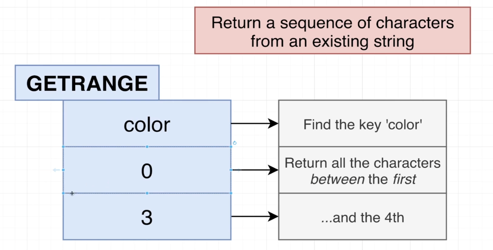
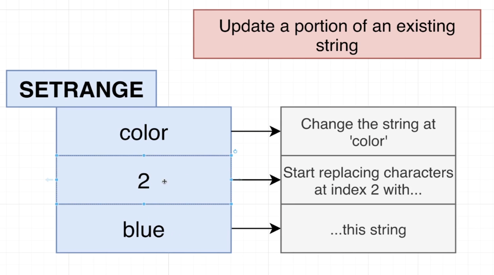
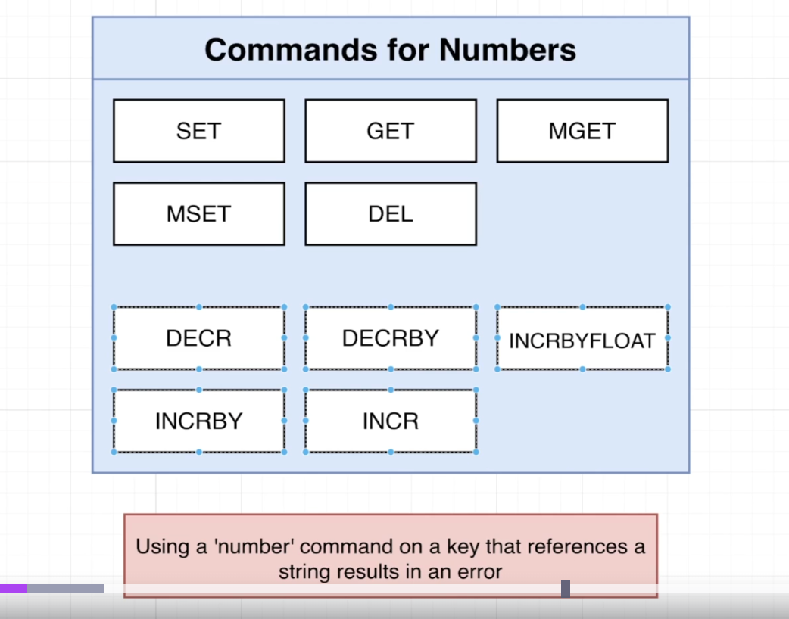
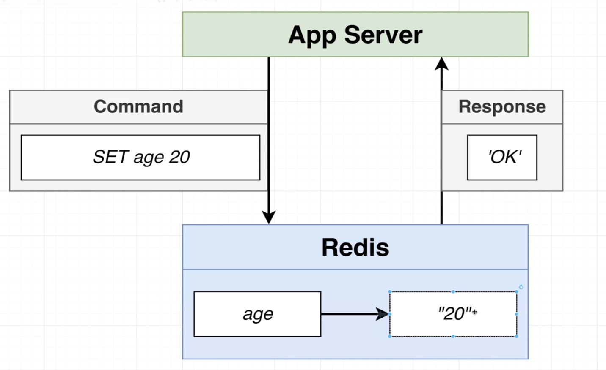
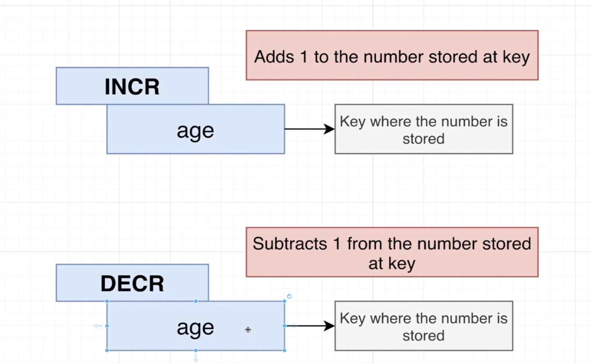

`SET message 'Hi there!'`

- command that's going to save a simple string inside of our database.
- We've got a key of message and if we ever refer to that variable or that key name in the future, we're going to get back a string of "Hi there".
- After saving that data reticence back in response to us of OC, which simply means okay, the data has been saved successfully.

`GET message`

- if I then want to retrieve information that I have stored.

## GET and SET

- Now the get and set commands that we just made use of are two very simple commands that are intended only for storing plane strings and plane numbers.
- there are many other types of data that we can store inside of Redis.

## SET

`SET color red`

- returns ok

`SET color red`
`SET color green GET`

- returns last value red

`SET asdf 'sdfsfd ghjk' XX`

- returns null because `XX` means set this value only if the key already exists.

`SET color blue NX`

- returns null because `NX` means set this value only if the key doesn't already exists.

`SET color red EX 2`
`GET color`

- color key will expire in 2 seconds so if get within 2 seconds we will get the value

`GET color`

- If we get after 2 seconds then we will get null value.

- We just made use of the option EX. PX allows you to designate how long to wait in milliseconds. EXAT and PXAT allow to specify a date time. KEEPTTL means keep any expiration that has already been applied to this key.

- Redis was originally designed as a caching server. That means that it's going to keep around some amount of data for some period of time and then eventually just plain get rid of it when it's not needed anymore.

# News API redis example

- Well, assume that we get some request in for news headlines and we want to respond to this request as fast as we possibly can. So our API might decide to first see if the latest headlines are stored inside of Redis at this point. If No data inside of your whatsoever. As soon as the API sees that no data is available inside of Redis, it might fall back as a second choice to trying to get some data out of our traditional database, which in general is probably going to be much slower than using Redis.

- The API is going to get a copy of those latest headlines and send them back in response to whoever made that original request Simultaneously it might also store a copy of the latest headlines inside of Redis. When another request comes in for news headlines, the API might again check to see if the data is available in Redis. The API can take the data right here very, very quickly as it did not have to access the traditional database and immediately sent back a response right away.

- But the downside here is that we might not have anything available for any other part of our application to automatically update the headlines inside of Redis. Remember, Redis, all of its data has to be stored in memory. So we can't always just put all of our headlines in Redis because we might eventually run out of memory. But to get around that problem, we might decide to automatically delete this particular headline after it has not been accessed in any way in some number of seconds or milliseconds, maybe after 10 seconds passed.

# SET and SETEX

# SET and SETNX

# MSET can be used to set multitple key value pairs simultaneously.

`SETEX color 2 red`

`GET color`

- This will return null after 2 seconds

`MSET color red model toyota`
`GET color`
`GET model`

# MGET

# DEL

`DEL color`
`GET color`

- This will return null.

# GETRANGE

`GETRANGE model 0 2`

# SETRANGE

`GET model`

- This will return Toyota.

`SETRANGE model 2 blue`
`GET model`

- This will return toblue

# number commands

- Internally, Redis is going to store that number as a string of 20. That's a string right there inside of Redis. It is understood to be a string. When we try to retrieve that value. So if we do a get age registers going to send back to us a string containing the number 20. And so inside of our app server, we have to take that string. We have to pass it to turn it into a plane number.

`SET age 20`

`DECR age`
`GET age`

`INCR age`
`GET age`

`INCRBY age 20`
`GET age`

`DECRBY age 5`
`GET age`
